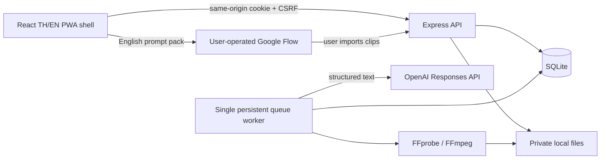

# System architecture

STATUS: STABLE_FOR_PHASE_0A

## Engineering amendment — 2026-10-09

The Owner now requests a cloud control plane with Supabase PostgreSQL structured data,
Google Drive primary media, and a local editing worker. This supersedes the local-only
deployment target while retaining the verified Express/TypeScript stack and existing APIs.
Antigravity exclusively owns src/, public/, design references and UX/UI specifications in
its separate worktree; engineering owns backend, additive contracts, tests and core docs.

Implementation is incremental. Existing SQLite/auth/session/queue/FFmpeg remains the
working local lane; no populated schema is migrated or copied automatically. New Drive,
provider-selection and Supabase/cloud queue adapters are dependency-injected and opt-in.
Absent credentials use explicitly labelled mock AI/test repositories, never a fake connected
Drive or real cloud success. No Supabase project for this app is configured at this checkpoint.

The cloud target is an always-on same-origin Express host plus Supabase structured project/
job records and Google Drive private media. Cloud AI jobs may run while a laptop is offline;
local FFmpeg jobs must remain queued until an authorized laptop worker is online. A public
PWA shell alone cannot execute cloud work offline without that deployed control plane.
No private data or offline submissions enter the public service-worker cache.

This checkpoint prepares adapters and contracts before remote activation. PostgreSQL DDL
is reviewable SQL only, never applied to an existing project. Production cutover requires
chosen project, owner-approved schema application, verified persistence/session migration,
Drive OAuth authorization, HTTPS/origins and worker credential enrollment. Cloud deployment
and billing are external gates, not simulated acceptance.

Provider policy: retain OpenAI structured output and one paid request. Mock mode produces
visible TH/EN fixtures. Explicit auto mode may fall back only on missing configuration or
quota/access failure, never refusals, malformed output, timeouts or ambiguous paid requests.
Mock titles/explanations/prompts identify sample provenance even in the unchanged frontend.
Google Flow remains user-operated primary video generation; Meta AI supporting work is
manual/unconfigured until an official supported integration is selected. Remotion is an
optional future editing adapter; the verified FFmpeg implementation stays active.

Cloud queue: service-side owner filtering, validated project snapshots and atomic enqueue;
leases use worker identity plus an unguessable fencing token. Heartbeat/progress/completion
require the current token and unexpired lease. Expired work fails interrupted; paid jobs
are not replayed automatically. Local jobs never execute on the cloud worker. Schema/adapter
and mocked concurrency tests must precede any deployment or existing-data migration.

OAuth preparation uses exact redirect URIs, one-time owner/session-bound state, PKCE,
minimal drive.file scope, fixed Google HTTPS endpoints and encrypted server-side tokens.
No browser/response/log contains OAuth credentials or refresh tokens; invalid callbacks,
missing credentials and unconnected storage fail closed. Remote Drive writes require an
owner-authorized import/export operation, never automatic sharing or publishing.

## Local V1 architecture

React/TypeScript/Vite provides a small SPA without a second framework/server. Express 5
provides HTTP routes and middleware. Node 24 built-in SQLite avoids a compiled/native DB
dependency and external credentials for a fresh local workspace. FFmpeg was already
installed. npm is the discovered and selected package manager. Runtime dependency versions
are pinned; the required new lockfile is tracked. Built artifacts/databases/media are ignored.

Node SQLite APIs are synchronous; V1 performs short indexed operations, and only one
worker handles external AI/media operations asynchronously. WAL and busy timeout support
multiple connections. This is a local, low-concurrency architecture; cloud/multi-tenant
deployment would require a reviewed persistence/worker migration, not an automatic switch.

## Layout and dependency boundaries

`src/`: client; `shared/`: schemas, contracts, module registry; `server/ai/`: provider;
`server/`: app/auth/store/queue/media entry points; `tests/`: isolated regression tests;
`scripts/`: dev and validation tooling; `docs/`: specifications. `storage/`: ignored runtime
DB, uploads, work/output folders. `.worktrees/`: ignored isolated writer checkouts.
Client imports public types only; it cannot import server config, filesystem or key access.
Shared contracts freeze first, backend and client implement independently against them.

## Persistence schema (Root-owned)

- users: id, unique normalized username, salted password hash, creation timestamp.
- sessions: hashed opaque token, user id, CSRF token, expires timestamp.
- projects: id, owner id, brief JSON, ideas JSON, selected idea id, package JSON,
  production status, creation/update timestamps.
- clips: id, project id, scene id, internal filename, original name, probed duration, timestamp.
- jobs: id, project id, owner id, type, status, progress, safe error code, timestamps.
- exports: id, project id, internal filename, aspect ratio, timestamp.

Prepared statements and owner filters are mandatory. Schema creation applies only to a
new local database; later migrations require Owner approval. Queue claim/status updates
are transactional. One active job per project avoids races and duplicates. Restarted
running jobs become interrupted failures; paid generation is never silently replayed.

## Configuration and deployment limits

Default host 127.0.0.1, API port 3001, Vite port 5173 with /api proxy. Production local
server serves dist/web and API on one origin. Environment config is server-only and has
validated defaults. No env file is created; the authorized environment key is reused.
OPENAI_IDEAS_MODEL defaults to gpt-6-luna; OPENAI_EXPAND_MODEL to gpt-6.1-sol with low
reasoning. Owner can configure models; failures do not silently change models or retry.
HTTPS and approved origin/cookie configuration are required before non-loopback deployment.

## Official references consulted

- [Node SQLite](https://nodejs.org/api/sqlite.html): DatabaseSync and version constraints.
- [Vite guide](https://vite.dev/guide/): Node support and React/TypeScript build workflow.
- [Express security](https://expressjs.com/en/advanced/best-practice-security/): input and cookie protection.
- [OpenAI models](https://developers.openai.com/api/docs/models): configurable text model choices.
